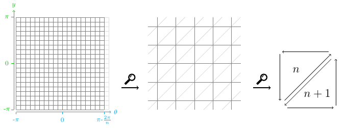

.. _cylinder:

========
Cylinder
========

Coordinate system
=================

.. _objmake-cylinder:

objMake
=======

.. _objmakesine-cylinder:

objMakeSine
===========

.. _objmakenoise-cylinder:

objMakeNoise
============

.. _objmakebump-cylinder:

objMakeBump
===========

.. _objmakecustom-cylinder:

objMakeCustom
=============
