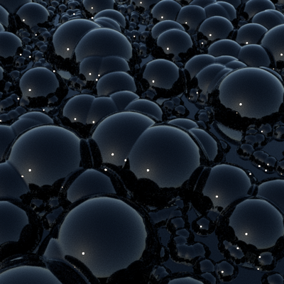

.. _gallerybubbles:

================
Bubbles
================

This example illustrates a few different things.  First, how to use a
custom, user-defined function to determine the perturbation type.
Second, how to provide several sets of parameters to that function.
Third, the effect of using the "max" instead of the usual "add" mode
when combining perturbations.

Code for producing the model::

  % A function that makes a "dome" shape, a hemisphere, that are used
  % to give the appearance of bubbles.  The first
  % input argument is distance, the second is the radius of the
  % half-sphere.
  f = @(d,r) (d<=r).*sqrt(r^2 - d.^2);

  % Make the model.  The three rows of the parameter matrix define three
  % sets of parameters to our function.  The three sets differ in scale
  % to make bubbles of different size.  In each row, the first parameter
  % is the number of bubbles, the second is a cut-off value, and the
  % third is the radius.  The cut-off and radius are the same in this case.
  objMakeCustom('plane',...
                f,...                     % a handle to our function
                [24 .15 .15;              % 24 large bubbles
                 120 .1 .1;               % 120 medium ones
                 1200 .03 .03],...        % and 1200 small bubbles
                'width',2,'height',2,...  % larger than the default plane
                'npoints',[512 512],...   % finer mesh
                'max',true,...            % don't add overlapping bubbles
                'normals',true,...        % improved rendering
                'bubbles.obj');           % save in bubbles.obj

.. highlight:: xml

XML for rendering with Mitsuba.   ::

  <scene  version="0.5.0">
    <integrator type="path">
      <boolean name="hideEmitters" value="true"/>
    </integrator>

    <sensor type="perspective">
      <transform name="toWorld">
        <lookAt origin="0, 1, 1.5" target="0, 0, 0.3" up="0, 1, 0"/>
      </transform>

      <float name="farClip" value="30"/>

      <sampler type="ldsampler">
        <integer name="sampleCount" value="200"/>
      </sampler>

      <film type="hdrfilm">
        <integer name="width" value="512"/>
        <integer name="height" value="512"/>
        <rfilter type="gaussian"/>
      </film>
    </sensor>

    <shape  type="obj">
      <string  name="filename"  value="bubbles.obj"/>
      <bsdf  type="dielectric">
        <string  name="intIOR"  value="water"/>
        <string  name="extIOR"  value="air"/>
      </bsdf>
      <transform name="toWorld">
        <rotate x="1" angle="-90"/>
      </transform>
    </shape>

    <emitter  type="sunsky">
      <float name="scale"  value="10"/>
      <vector name="sunDirection" x="-1" y="1" z="1"/>
  </scene>

Please note that this is just an example.  There's no guarantee these
are in any way reasonable, or sensible, modeling or rendering
parameters for a particular application. 
