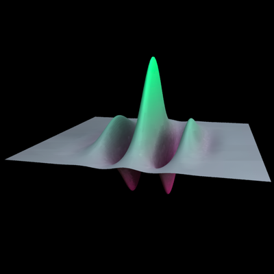

.. _gallerygabor:

=======
A Gabor
=======

TODO.  A couple aims.  Demonstrate the use of objMakeCustom with a
user-define input matrix.  Second, use Radiance for texture mapping.

TODO

TODO

TODO

Please note that this is just an example.  There's no guarantee these
are in any way reasonable, or sensible, modeling or rendering
parameters for a particular application. 
