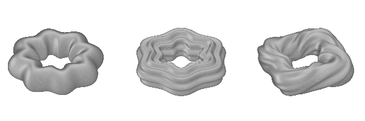

.. _galleryradialfreq:

================================
Radial frequency -modulated tori
================================

Code::

  m(1) = objMake('torus','rpar',[8 .1 0],'torus_plain');
  m(2) = objMakeSine('torus',[8 .05 90 90],'rpar',[6 .1 0],'torus_sine');
  m(3) = objMakeNoise('torus',[10 1 30 30 .1],'rpar',[4 .15 0],'torus_noise');

  figure
  for ii = 1:length(m)
    subplot(1,length(m),ii);
    objShow(m(ii));
  end

Please note that this is just an example.  There's no guarantee these
are in any way reasonable, or sensible, modeling or rendering
parameters for a particular application. 
