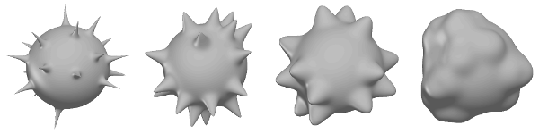

.. _galleryspikes:

=============
Spiky spheres
=============

Code::

  % Make a function that defines the spike/bump profile.  The first
  % input argument has to be distance, the second one is a vector with
  % three parameters:
  % 1. an exponent defining the sharpness of the spike/bump
  % 2. a scale parameter
  % 3. height
  spike = @(d,prm) prm(3)*exp(-d.^prm(1)/prm(2).^2)

  % Define values for the arguments to the above function.
  a = [1 1.5 2 3];   % "spikyness" parameter, goes from sharp to blunt
  b = pi/16;         % scale
  r = [.6 .5 .4 .2]; % height

  % Make the models, also save them to file
  for ii = 1:length(a)
    filename = sprintf('spiky_%02d.obj',a(ii)*10);
    m(ii) = objMakeCustom('sphere',spike,[20 pi/4 a(ii) b r(ii)],...
                          'npoints',[512 256],'mindist',pi/8,filename);
  end

  % Show the models
  figure
  for ii = 1:length(a)
    subplot(1,length(a),ii)
    objShow(m(ii));
  end

Please note that this is just an example.  There's no guarantee these
are in any way reasonable, or sensible, modeling or rendering
parameters for a particular application. 
