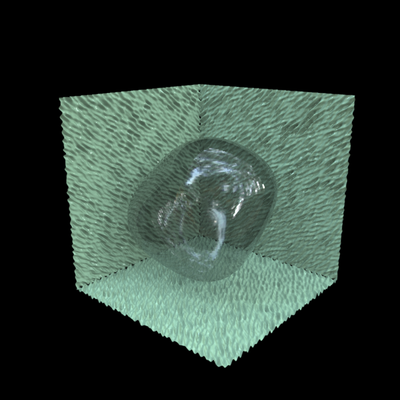

.. _gallerytransparentblob:

================================================
Transparent blob with noisy, textured background
================================================

Code for producing the model::

  % Make a blob: a sphere with large Gaussian bumps.  Also define a
  % material name, 'blobmat':
  objMakeBump('sphere',[8 .25 pi/8],..
              'material','blobmat',   
              'blob.obj');

  % Make three noisy planes.  Also define material name, 'bkgrmat':
  noiseprm = [32 1 45 45 .02];
  for ii = 1:3
    objMakeNoise('plane',noiseprm,   
                 'material','bkgrmat',
                 sprintf('background%0d.obj',ii));
  end

.. highlight:: none

The example above was rendered in Radiance.  The commands and files
below assume Radiance is installed.

Convert the ``.obj`` files to Radiance ``.rad`` files.  Note that
``rad`` is not the only format, and in many cases, it will make sense
to use another Radiance format.  See other examples in the Gallery and
in the manual, and Radiance documentation. Here we just use ``.rad``.
In the terminal, do::
   obj2rad blob.obj > blob.rad
   obj2rad background1.obj > background1.rad
   obj2rad background2.obj > background2.rad
   obj2rad background3.obj > background3.rad

Next, the file for the whole scene.  The following is the contents of the file
``scene.rad``.  Note that the material names in the baginning of the
file have to match the material names used above when creating the models::

  #------------------------------------------------
  # Materials

  void glass blobmat
  0
  0
  3 0.75 0.75 0.75
  # red, green, blue transmissivity

  void plastic bkgrmat
  0
  0
  5 0.65 1.0 0.65 .05 0
  # red green blue specularity roughness

  void plastic black
  0
  0
  5 0.0 0.0 0.0 .0 0
  # red green blue specularity roughness

  #----------------------------------------
  # Light source 

  #LightField:hdr_env
  void colorpict hdr_env
  13 red green blue rnl_probe.hdr angmap.cal sb_u sb_v -rx 0 -ry 180 -rz 0
  0
  0

  hdr_env glow glow_mat
  0
  0
  4 1 1 1 0	

  #light field
  !genrbox glow_mat boxenv 50 50 50 -i | xform -t -25 -25 -25

  #----------------------------------------
  # A black background

  black polygon bkgr1
  0
  0
  12
          -2.0 -2.0 -2.0
           6.0 -2.0 -2.0
           6.0  6.0 -2.0
          -2.0  6.0 -2.0

  black polygon bkgr2
  0
  0
  12
          -2.0 -2.0 -2.0
          -2.0  6.0 -2.0
          -2.0  6.0  6.0
          -2.0 -2.0  6.0

  black polygon bkgr3
  0
  0
  12
          -2.0 -2.0 -2.0
          -2.0 -2.0  6.0
           6.0 -2.0  6.0
           6.0 -2.0 -2.0

  #----------------------------------------
  # Finally, put the blob and other elements in place

  !less background1.rad   | xform -rx 0 -ry 0 -rz 0 -s  1.0 -t 0.5 0.5 0.0
  !less background2.rad   | xform -rx 0 -ry -90 -rz 0 -s  1.0 -t 0.0 0.5 0.5
  !less background3.rad   | xform -rx 90 -ry 0 -rz 0 -s  1.0 -t 0.5 0.0 0.5
  !less blob.rad | xform -rx 0 -ry 0 -rz 0 -s  0.3 -t  0.5 0.5  0.5

The next is a ``.rif`` file that holds information and parameters for
the rendering process.  The contents of the file ``scene.rif``::

  ZONE= I  -2 2 -2 2 -2 2
  scene = scene.rad
  objects = blob.rad background1.rad background2.rad background3.rad scene.rif
  EXPOSURE = 1
  QUALITY = h
  INDIRECT = 0
  DETAIL = h
  VARIABILITY = m
  RESOLUTION = 800
  PENUMBRAS = t
  PICTURE = scene  
  view = -vp 2.0 1.25 2.3 -vd -2.0 -1.0 -2.3 -vu 0 1 0
  render = -av .0 .0 .0

Finally, to render, run in terminal::
  
  rad scene.rif

Please note that this is just an example.  There's no guarantee these
are in any way reasonable, or sensible, modeling or rendering
parameters for a particular application. 
