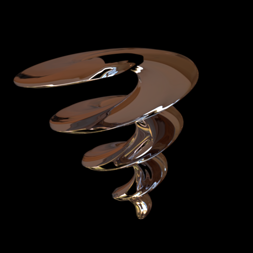
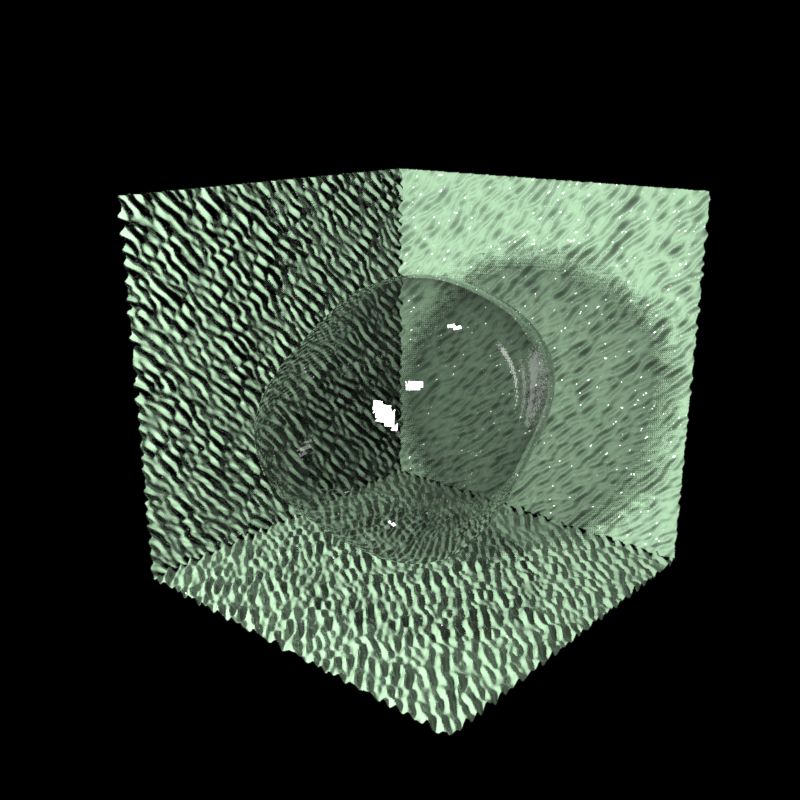

.. _gallery:

*******
Gallery
*******

Radial frequency patterns with the torus.  No other shape modulation,
just the major radius.

.. toctree::
   :maxdepth: 1
   
   gallery-corkscrew
   gallery-transparent-blob
