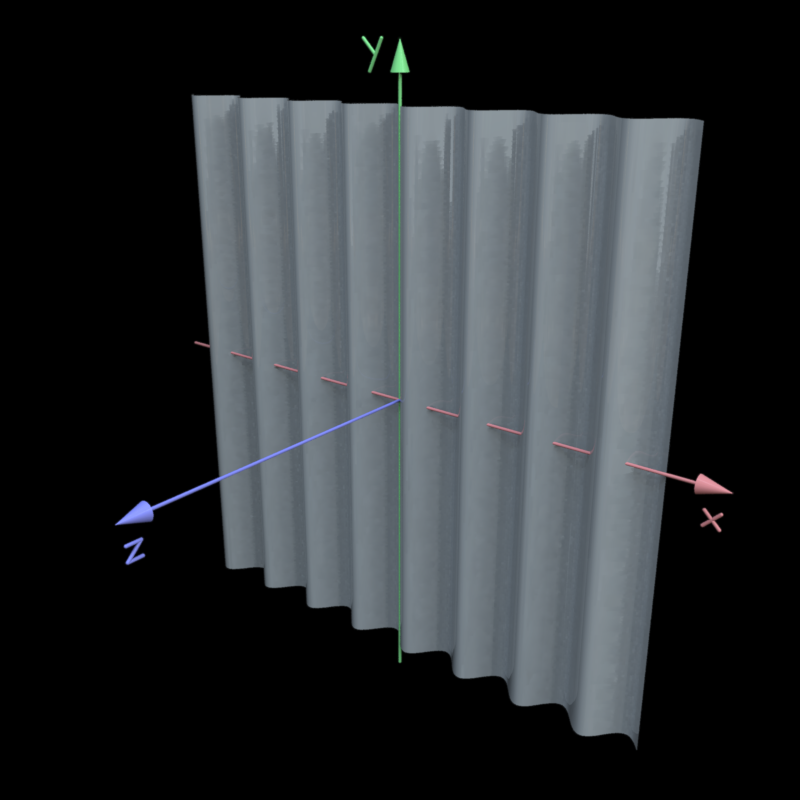

.. _plane:

======
Plane
======

.. image:: ../images/plane_coords.png

Coordinate system
=================

The plane lies on the xy-plane, with perturbations added in the
z-direction.  The picture above shows the coordinate system in 3D and
2D space, and the pictures to the right show how the triangluar faces
are arranged.

For oriented perturbations, 0 is vertical (modulation as a function of
the x-coordinate), 90 is horizontal.

Default mesh size
=================

The default size (number of vertices) for the plane is 128-by-128.
For models with very high-frequency perturbations or otherwise fine
detail, you might want to increase the mesh size.  To do this, use the
option ``npoints``::

  objMakeSine('plane',[32 .1 0 0],'npoints',[320 320]);

Default model size
==================

Width, height = 1.  Centered at the origin.
