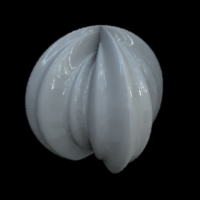
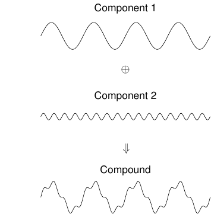
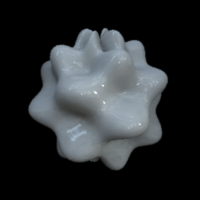

.. _qs-components:

Adding components
*****************

The modulations are not restricted to one component.  If more than one
component are defined, the modulations are added together.  The
modulation components are defined in the rows of the first input
argument.  The following example has two components, both with the
same angle but with different frequencies::

  par = [4  .2  0 0;
         16 .05 0 0]
  objMakeSine('sphere',par);

The schematic on the right shows the individual and compound profiles.

Or you can have two components at different angles::

  objMakeSine('sphere',[8 .1 0 0; 8 .1 90 90]);

.. image:: ../images/sphere008.png

The same but with non-cardinal angles::

  objMakeSine('sphere',[8 .1 0 60; 8 .1 0 -60]);

There is no limit to the number of components you can add.  Note,
however, that there's not much error checking done on the input
arguments.  If several components are added with large enough
amplitudes (and with appropriate phases), the total amplitude can
exceed the radius of the sphere.  The results may look wonky.

