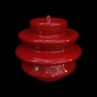

.. _qs-material:

===========================
Setting material properties
===========================

Material library (.mtl) files
=============================

The appearance of a given model can be changed by changing its
material properties.  By setting these properties you can control the
color, how the material reflects light, its transparency, and so
forth.

The materials are usually specified in a separate file.  These
materials are named, and the the .obj-file where the model is saved
then refers to these files for material specifications.  A 'material
template library' (.mtl) file format that accompanies an .obj-file is
a common way to define the materials, but not all renderers understand
the .mtl files (for example Radiance; more on that later).

Note that |toolbox| **does not have any functionality to create the
material specifications**.  But it does have an option to define the
material names and the name of the .mtl-file from which those
materials are found.  An example might help::

  objMakeSphere([12 .15 90 90],'material',{'matfile.mtl','red_plastic'},'redsphere.obj');

will produce the file ``redsphere.obj`` that contains the model object
and references to the material library ``matfile.mtl`` and to the
material ``red_plastic``.  Now, if in the same directory there is a
file ``matfile.mtl`` with the following lines::

  newmtl red_plastic
    Ka 1.0000 0.0000 0.0000
    Kd 1.0000 0.0000 0.0000
    Ks 1.0000 1.0000 1.0000
    Ns 100
    illum 1

the model, when viewed, should appear shiny red, that is, not entirely
unlike:

Materials in Mitsuba
====================

The various programs and renderers available differ in the way
the materials are specified.  Some may not understand or use the
.mtl-files.  In these cases you have to define the materials in the
native way for the program you're using.

TODO: Example of how to set simple materials in Mitsuba.

Materials in Radiance
=====================

When using Radiance, you must, first, convert the .obj-file to a
format Radiance knows how to use.  The simplest is to use the
``obj2rad`` -program of Radiance.  To convert the model from the above
example to a Radiance .rad-file, one would do in the terminal
(assuming Radiance is installed, a process which most definitely will
never be covered in this tutorial)::

  obj2rad redsphere.obj > redsphere.rad

The resulting ``redsphere.rad`` can now be rendered with Radiance.
The material names survive the conversion---conversion to .rad keeps
the name of the material we defined in the .obj-file
('red_plastic')---but Radiance does not use the associated material
library (the .mtl-file), as its material specifications are different
(Radiance material desciptions correspond to physical materials such
as plastic, glass, and metal).  You must specify the material
``red_plastic`` in Radiance to get the desired appearance.  Something
along the lines of::

  # modifier material material_name
  void plastic red_plastic
  0
  0
  5 1.0 0.0 0.0 .02 0
  # red green blue specularity roughness

Note: If the .obj-file does not contain material names (if no
materials are defined using the 'material'-option), Radiance assigns
the default material 'white' to the object in the obj2rad-conversion.

.. obj2mesh

This section is not meant to be a rendering tutorial, it only explains
how the references to materials are defined when creating the model.
More on rendering in a later section.

No groups
=========

In .obj-files, faces can be assigned to different groups so that
different materials can then be specified for different parts of the
object.  **No groups for the faces and materials are implemented in**
|toolbox|.  You can only set one material for the whole object.
