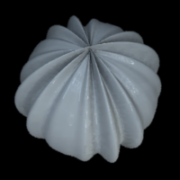
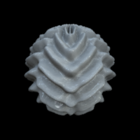

.. _qs-modulation:

=========================
Modulating the modulation
=========================

In the examples so far, the modulation had a constant amplitude
everywhere.  It is possible to produce more complex or varied
modulations by using separate carrier waves and envelopes.  In the
examples so far, we have been using only the "carrier" components.
The envelope multiplies the carrier amplitude as illustrated below:

.. image:: ../images/carrier_modulator.png

The envelope (or "modulator") parameters are given as the second input
argument to :ref:`ref-objmakesphere`.  The format of the parameter
vector is the same as that for the carrier components.  The example
below has a single carrier component and a single envelope, or
modulator::

  objMakeSphere([16 .1 0 0],[4 1 0 0]);

The carrier and the envelope do not need to have the same orientation.
When using vertical carriers, the ridges in the sphere object become
very sharp near the poles of the sphere (as this is where the
meridians, or lines of longitude, meet).  To smooth these out, we
could add a low-frequency, orthogonal envelope::

  objMakeSphere([12 .1 0 0],[2 1 90 90]);

.. image:: ../images/modsphere002.png

Sometimes you might want to have one envelope modulating one carrier
and another envelope modulating another carrier.  This way you can,
for example, alternate between two carriers.  In the next example, we
have two high-frequency carriers that have opposite angle but that are
otherwise identical.  They are modulated by two low-frequency
envelopes that are 180 degrees out-of-phase but otherwise identical.
They way to connect the carrier to the envelope is to use an
additional parameter, the **group index**.  The format of the
parameter vector is then::
  
  par = [frequency amplitude phase angle groupid]

This example sets group indices 1 and 2 for the first and second
component. ::

  prm_carr = [20 .1 0 60 1; 20 .1 0 -60 2];
  prm_env  = [4 1 0 0 1; 4 1 180 0 2];
  objMakeSphere(prm_carr,prm_env);

Group index 0 is special: A **carrier** that has a group index of 0 is
added to the other components as is, before being multiplied by any
envelope.  These other components might be either single carriers or
carriers already multiplied with an envelope (with a non-zero group
index).  An **envelope** that has a group index 0 multiplies **all** the
other components after they have been added together.  This is used in
the following example, which is a modification of the one above.  We
define the modulated carrier components as above, but in addition we
add an orthogonal modulator to get rid of the high-frequency ridges at
the poles.  We give this third envelope a group index of 0 so that it
multiplies **all the other components after they have been added
together**.  Zero is also the defaul group index if none is defined. ::

  prm_carr = [20 .1 0 60 1; 20 .1 0 -60 2];
  prm_env  = [4 1 0 0 1; 4 1 180 0 2; 2 1 90 90 0];
  objMakeSphere(prm_carr,prm_env);

.. image:: ../images/modsphere004.png

If there is more than one carrier in a group, they are added together
first before being multiplied by the envelope.  If there is more than
one envelope in a group, they are added together before they multiply
the carriers.

