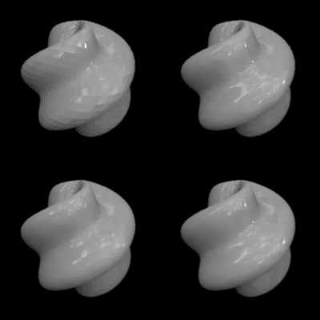

.. _qs-normals:

======================================
Improved rendering with vertex normals
======================================

|toolbox| saves the 3D models as Wavefront .obj-files.  The shape is
represented as a collection of vertices and polygons, or faces,
defined by these vertices.  The .obj-file stores the vertex positions
and the information about the faces (a face is a list of vertices).
The more vertices (and faces) there are, the better a smoothly curved
surface can be approximated.  Of course, the more vertices, the larger
the file size.  A typical way to improve the quality of rendering of
the model is to define vertex normals.  A vertex normal is a
three-dimensional vector that points in the direction of the surface
normal of the surface-to-be-approximated at that location.

|toolbox| has an option to compute the vertex normals.  By default
the computation is off to facilitate quick testing (computing the
normals takes time), but it might be useful to turn it on for the
final model.

To turn the computation of normals on, set the ``'normals'``-option to
``true``::

  % by default, vertex normals are not computed:
  objMakeSphere([4 .15 0 60])
  
  % option 'normals' turns computation of surface normals on:
  objMakeSphere([4 .15 0 60],'normals',true)

The following example illustrates the effect of including the surface
normals.  It also illustrates another option, ``'npoints'``, which
defines the resolution (number of vertices in the elevation and
azimuth directions) of the model.  The example makes the same object
in four ways: with two resolutions and with surface normal computation
turned on/off. ::

  objMakeSphere([6 .15 0 60],...
                'npoints',[32 64],...
                'normals',false,...
                'sphere_lowres_no_normals.obj')

  objMakeSphere([6 .15 0 60],...
                'npoints',[32 64],...
                'normals',true,...
                'sphere_lowres_with_normals.obj')

  objMakeSphere([6 .15 0 60],...
                'npoints',[64 128],...
                'normals',false,...
                'sphere_hires_no_normals.obj')

  objMakeSphere([6 .15 0 60],...
                'npoints',[64 128],...
                'normals',true,...
                'sphere_hires_with_normals.obj')

A few notes about the computation of vertex normals:

- Including normals results in a larger file size
- Some rendering programs might compute the normals for a given model
  object, so depending on what software you are using for rendering,
  you might or might not want to include the normals in the .obj-file.
- The computation of the normals in |toolbox| is not particularly
  advanced.  It should do a good job for most shapes that are
  reasonably smoothly varying (and the functions in this toolbox are
  mainly meant to produce smoothly varying shapes.).  **It does not
  handle sharp edges robustly**, but calculates the surface normals as
  it would for a smoothly curved surface.
