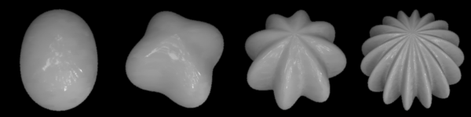
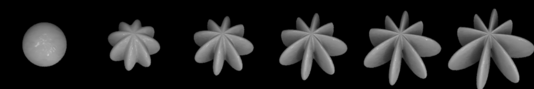

.. _qs-series:

==========================
Making a series of stimuli
==========================

One of the purposes of |toolbox| is to provide a tool for making
sets of stimuli with parametric variations in shape.  This section
illustrates the creation of some example series.  This section does
not introduce any new functionality of the toolbox, it's just calling
the now-familiar function :ref:`ref-objmakesphere` inside a simple
Octave/Matlab loop.

The first example has a single component.  The frequency is varied
from 2 to 16 cycles while the other properties stay constant.  An
orthogonal envelope is used as in the previous examples. ::

  % Set a vector of frequencies
  freq = [2 4 8 16];
  
  % Set other parameters to constant values
  a  = .15;  % amplitude
  ph = 0;   % phase
  or = 0;   % angle/orientation
  
  % Loop through frequencies
  for ii = 1:length(freq)
    % Set filename with frequency value
    filename = sprintf('sphere_f%02d.obj',freq(ii));
    % Make the model
    objMakeSphere([freq(ii) a ph or],[2 1 90 90],filename);
  end

The code above produces a series of four objects which, rendered, will look like:

The next example also has a single component.  The amplitude varies
from 0 to 1 with other properties constant.  With modulation amplitude
0 the object is a sphere.  With higher amplitudes it's... well, most
certainly not a sphere anymore::

  % Set a vector of amplitude
  a = 0:.2:1;
  
  % Set other parameters to constant values
  f  = 8;   % frequency
  ph = 0;   % phase
  or = 0;   % angle/orientation
  
  % Loop through frequencies
  for ii = 1:length(a)
    % Set filename with frequency value
    filename = sprintf('sphere_a%03d.obj',100*a(ii));
    % Make the model
    objMakeSphere([f a(ii) ph or],[2 1 90 90],filename);
  end

which gives:

  
One more example: Here we have two components, and we vary their
amplitudes in opposition to smoothly transition from component-1-only
to little-bit-of-both-components to component-2-only::

  % Set amplitudes of the two components.  These are between 0 and 0.1,
  % in steps of 0.02, varied in opposition to each other.
  a1 = .1:-0.02:0  % goes from 0.1 to 0.0
  a2 = .1 - a1;    % goes from 0.0 to 0.1
  
  % Set other parameters to constant values
  freq =  20;    % frequency
  ph   =   0;    % phase
  or1  = -60;    % angle/orientation of component 1
  or2  =  60;    % angle/orientation of component 2
  
  % Loop through frequencies
  for ii = 1:length(freq)
    % Set filename with frequency value
    filename = sprintf('sphere_%03d_%03d.obj',100*a1(ii),100*a2(ii));
    % Make the model
    objMakeSphere([freq a1(ii) ph or1; freq a2(ii) ph or2],[2 1 90 90],filename);
  end

And the series of objects rendered:

.. image:: ../images/series003.png

Note that these are only examples of making and saving a series of
stimuli.  The particular stimuli produced are not necessarily
interesting or informative to use in a vision experiment.
