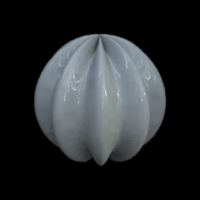
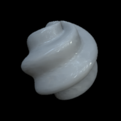

.. _qs-simplesphere:

A modulated sphere
*************************

Let's start simple.  The command::
  
  objMakeSphere();

makes a model sphere, modulated with the default parameters: vertical
modulation, eight cycles around the sphere, with an amplitude of 0.1.
The model is saved in the file ``sphere.obj``.  You can view the saved
model object with one of the programs suggested in the section
:ref:`qs-viewing`.  Rendered, it would look something like this:

.. image:: ../images/sphere001.png

Next, we'll start changing some of the parameters of the modulation.
The parameters are given as the first input argument to
:ref:`ref-objmakesphere`.  The parameter vector defining the
modulation parameters has the form::

  par = [frequency amplitude phase angle]

To have a frequency of 10 cycles per sphere instead of the default 8
and saving the model in the file ``sphere_10cycles.obj``::

  sphere = objMakeSphere([10 .1 0 0],'sphere_10cycles.obj');

In the above example, the vertex and face information of the object
are also returned in the fields of the structure ``sphere``.  Usually
you don't need to do this---most often you just want to have the model
saved in a file.  But sometimes you might want to get the structure
for quick viewing with the function :ref:`ref-objshow`.  So after
running the above command you might do::

  objShow(sphere)

You can also go lower in frequency, such as in the example below.
Note that the frequency is given in cycles per :math:`2\pi` (that is,
in number of cycles around the sphere).  If frequency is not an
integer, the modulation will not wrap around the object smoothly and
you will have a discontinuity at 0 and :math:`2\pi`::

  objMakeSphere([3.5 .2 0 0]);

.. image:: ../images/sphere003.png

To have the modulation in the elevation ("horizontal") instead of the
azimuth direction, change the angle parameter.  The angle of the
modulation is given in degrees, so value 90 gives a "horizontal"
modulation::

  objMakeSphere([8 .1 0 90]);

.. image:: ../images/sphere004.png

By default, the modulations are in sine phase.  In the above example,
the top and bottom parts of the objects are not symmetrical (i.e., the
object is not symmetrical with respect to the x-y plane).  To have that
symmetry, change the phase of the modulation by 90 degrees::

  objMakeSphere([8 .1 90 90]);

.. image:: ../images/sphere005.png

The angle of the modulation does not have to be 0 or 90 degrees;
intermediate angles are possible:

::
   
   objMakeSphere([8 .1 0 60])

Any arbitrary angle can be used, but note that at most angles the
modulation does not wrap around smoothly around the object.  To find
out which angles will wrap smoothly at a given frequency, use the
helper function :ref:`ref-objfindangles`.  To find frequencies given
an angle, use :ref:`ref-objfindfreqs`.  For more information and
examples, see :ref:`helpers`.

