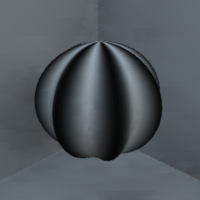

.. _qs-texture:

==============
Adding texture
==============

In the previous section, we defined a material that set the color and
specularity of the whole object.  With **texture mapping** it is
possible to define more complex surface color or texture patterns.
|toolbox| can compute texture coordinates (UV-coordinates) and save
them with the model.  These coordinates can be used to map a texture
(usually an image the user provides) onto the surface of the object.

By default, the computation of texture coordinates is turned off.  To
turn it on, use the 'uvcoords'-option and set its value to 'true'
::

   objMakeSphere([8 .1 0 0],'uvcoords',true,'sphere_with_uvcoords.obj');

Texture descriptions in .mtl -files
===================================

If you are using a program that understand mtl-files, you can use them
to define textures.  To do this, use the 'material'-option as in the
previous section on material properties.  Setting the
'material'-option forces the computation of the UV-coordinates.  For
example::

  objMakeSphere([8 .1 0 0],'material',{'matfile.mtl','mytexture'},'texturedsphere.obj');

produces a file called 'texturedsphere.obj' which includes the
UV-coordinates for texture mapping.  It also contains a reference to
the file 'matfile.mtl' and defines 'mytexture' as the material for the
object.

So far, we haven't mapped any textures yet.  The texture to map to the
UV-coordinates of the object we created has to be defined somewhere,
usually in the .mtl-file.  If we have an image file 'texture.tiff'
that contains a sine wave grating, coincidentally with the same number
of cycles (eight) as the model we made above:

.. image:: ../images/texture001.png

and we define the material 'mytexture' in the file 'matfile.mtl' like
so::

  newmtl mytexture
   Ka 0.500 0.500 0.500
   Kd 0.500 0.500 0.500
   Ks 0.500 0.500 0.500
   illum 2

   map_Ka texture.tiff   # ambient texture map
   map_Kd texture.tiff   # diffuse texture map
   map_Ks texture.tiff   # specularity texture map

and then view the model, we should see:

.. image:: ../images/texturesphere001.png

In the above example, the material library file 'matfile.mtl' sets the
same image---'texture.tiff'---as the texture map for ambient, diffuse,
and specular reflectivity of the object.  The values for Ka, Kd, and
Ks multiply the values of the texture maps.

Next, make another model with the modulation in opposite phase, but
use the same texture as above::

  objMakeSphere([8 .1 180 0],'material',{'matfile.mtl','mytexture'},'texturedsphere2.obj');

By using a different image as texture and/or changing the material
properties, you can have the texture pattern at a different
orientation, with a tint:

.. image:: ../images/texturesphere003.png

or map a picture of cat's fur onto a bumpy shape to get:

.. image:: ../images/texturesphere005.png

which should prove useful for some carefully controlled, low-level
psychophysics.

Mitsuba
=======

Texture mapping with Mitsuba is demonstrated in the
:ref:`rendering` -section of this manual.

Radiance
========

The material and texture properties are not transferred to Radiance
for the reasons explained in the previous section.  Texture mapping
with Radiance is demonstrated in the :ref:`rendering` -section of this
manual.

